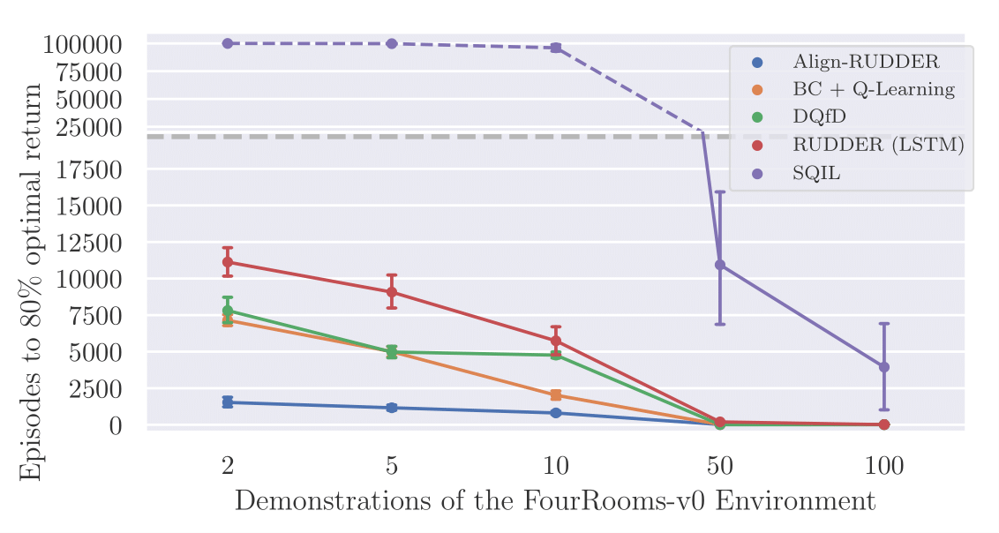
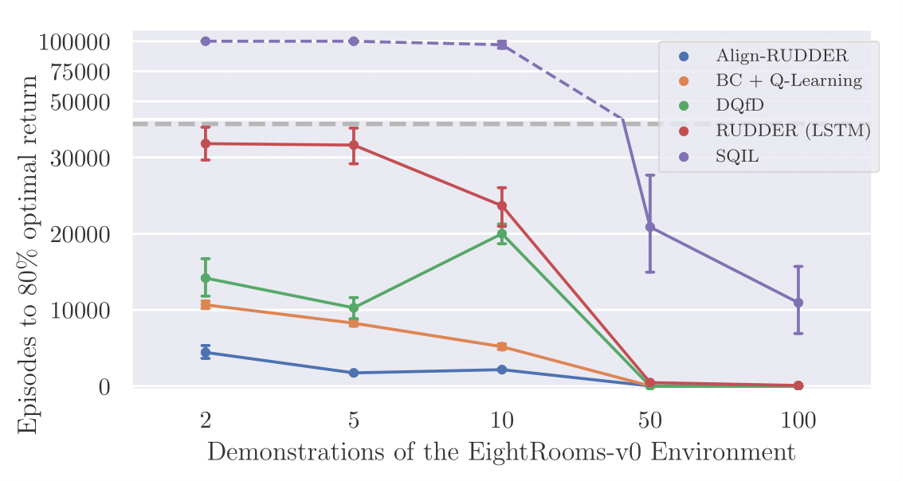

<link rel="stylesheet" href="assets/css/accordion.css">

This blog post explains the paper [Align-RUDDER: Learning from Few Demonstrations by Reward Redistribution](https://arxiv.org/abs/1806.07857).
Align-RUDDER is [RUDDER](https://arxiv.org/abs/1806.07857) with two modifications:

* Align-RUDDER assumes that episodes with high rewards are given as demonstrations.
* Align-RUDDER replaces the RUDDER's LSTM model by a profile model that is obtained from multiple sequence alignment of demonstrations.

[Blog post to RUDDER: Return Decomposition for Delayed Rewards](https://ml-jku.github.io/rudder) 

# Only Demonstrations Allow to Solve Complex Tasks in Reinforcement Learning

Reinforcement learning (RL) can solve simple tasks efficiently.
However, if tasks become more complex, e.g. consisting of hierarchical sub-tasks, RL requires a huge amount of samples.
The reason is that for more complex tasks, episodes with high rewards are difficult to find by current exploration strategies.
In contrast, humans and animals learn more efficiently by obtaining high reward episodes through teachers, role models, or prototypes. 
We believe that in RL this approach can be followed by learning from demonstrations.
In this context, we assume that episodes with high rewards are given as demonstrations and we are able to efficiently learn from as few as two episodes.

DeepMind's well known [AlphaGO](https://storage.googleapis.com/deepmind-media/alphago/AlphaGoNaturePaper.pdf) also uses demonstrations for behavioral cloning (supervised learning of policy networks) and was able to win against the [grandmaster Lee Sedol](https://www.theguardian.com/technology/2016/mar/15/googles-alphago-seals-4-1-victory-over-grandmaster-lee-sedol).
More recently, DeepMind's [AlphaStar](https://deepmind.com/blog/article/alphastar-mastering-real-time-strategy-game-starcraft-ii) StarCraft II agent was initialized by behavioral cloning (AlphaStar Supervised), i.e. trained with a [large number of demonstrations](https://twitter.com/oriolvinyalsml/status/1229489701574205441) (human games) and managed similar [success stories](https://www.nature.com/articles/d41586-019-03298-6) against professional human players.

Therefore, we believe that demonstrations are essential when bringing RL to the real world where the relevant tasks are typically highly complex.

# Delayed Rewards Increase the Complexity of Tasks

Delayed rewards are often episodic or sparse and common in real-world problems.
For real-world problems, reward for single actions is often not available, however, 
episodic rewards are easy as it can be given for achieving a goal or for completing a task.
Examples of episodic rewards are board games like chess or [Go](https://deepmind.com/research/case-studies/alphago-the-story-so-far).
Delayed rewards require a long-term credit assignment, which is still a great challenge in reinforcement learning.
[RUDDER](https://arxiv.org/abs/1806.07857) excels in long-term credit assignment for delayed rewards applying the concepts of reward redistribution and return decomposition (for more information [see RUDDER blog](https://ml-jku.github.io/rudder)).


# RUDDER Deals with Delayed Rewards Using Reward Redistribution

The main idea of RUDDER is to exploit the fact that the value function is a step function.
Complex tasks are hierarchical and are composed of sub-tasks or sub-goals.
Completing sub-tasks is reflected by a step in the value function.
In this sense, steps indicate events like achievements, failures, and/or changes of environment/information.
In general, a step in the value function is a change in return expectation (higher/lower amount of return or higher/lower probability to receive return).
The reward can then be redistributed to these steps.
In particular, identifying large steps is important since they speed up learning tremendously and results in:

* Large increase of return (after adjusting the policy).
* Sampling more relevant episodes.

Assume we have episodes with high rewards and average rewards.
Supervised learning identifies state-action pairs that are indicative for such high rewards.
We therefore want to adjust the policy in a way that these state-action pairs are reached more often.
The reward redistribution implemented by RUDDER achieves these state-action pair adjustments by using an [LSTM](http://karpathy.github.io/2015/05/21/rnn-effectiveness/) to predict the final return at every timestep.
Since the hidden state of the LSTM is able to store the history of events, we can focus on key events by computing the difference of predictions, which ultimately establish the contributions to the final return.

<div class="a-container">
  <div class="a-items">
    <label for="a1">Further details</label>
    <input type="checkbox" name="ac" id="a1" hidden />
    <div class="a-content">
      
      {{ accordion_include | markdownify }}
    </div>
  </div>
</div>
For more about reward redistribution theory and its realization in RUDDER using LSTMs, [see RUDDER blog](https://ml-jku.github.io/rudder).

# Align-RUDDER: RUDDER with Few Demonstrations and Multiple Sequence Alignment 

Above in our setting, we have assumed complex tasks, where episodes with high rewards are given as demonstrations.
To generate such demonstrations is often a tedious task for humans, and a
time-consuming process for automated exploration strategies.
Therefore, typically only a few demonstrations are available,
on which RUDDER's LSTM model as a deep learning method does not learn well.
We have to find an alternative to RUDDER's LSTM model for reward redistribution.
Therefore, we replace RUDDER’s LSTM model by a profile model that is obtained from [multiple sequence alignment](https://en.wikipedia.org/wiki/Multiple_sequence_alignment) (MSA) of demonstrations.
Profile models can be constructed from as few as two demonstrations as known from bioinformatics and allow for reward redistribution.

So now it's time for Align-RUDDER, which is RUDDER with two major modifications:
* RUDDER's lessons replay buffer is replaced by (few) demonstrations
* RUDDER’s LSTM model is replaced by a profile model obtained from MSA of demonstrations

Of course, Align-RUDDER also works with many demonstrations. 
Align-RUDDER inherits the concept of reward redistribution, which considerably reduces the delay of rewards, thus speeding up or enabling learning.

# Reward Redistribution by Align-RUDDER via Multiple Sequence Alignment

In bioinformatics, sequence alignment identifies similarities between biological sequences of different species to determine their evolutionary relationship and conserved regions in different sequences.
The underlying problem of this setting is much the same as identifying similarities between demonstrations from different players to determine their underlying strategy. As you can see, **these two settings align nicely**: 

* ```Sequences from different species sharing amino-acids•••• which conserve the biological function```
* ```Episodes• from different players sharing relevant events which conserve the underlying strategy```

The following figure shows, on the left, a multiple sequence alignment of biological sequences (triosephosphate isomerase) giving a conservation score. The right panel shows a multiple sequence alignment of demonstrations by different players (here, events have been encoded as amino acids to allow the use of the same tool for alignment).

{:refdef: style="text-align: center;"}

{: refdef}

The alignment techniques in Align-RUDDER identify shared events that represent the underlying strategy.
Reward is then redistributed to these shared events (for events see below).
The more players share the same event the more reward is redistributed to this event.
If an event is shared among all players this indicates achieving a sub-goal or completing a sub-task.
The episodes from different players are what we call demonstrations.

Consider one of the toy tasks from the paper. In this task, the environment is a simple grid world with four rooms.
The agent starts in the center of the bottom left room and has to reach the goal in the bottom right room.
At every location, the agent can move up, down, left and right (if there is no wall in the way).
In the first room there is a portal at a random position that teleports the agent into the second room. 
The portal is introduced to avoid that BC initialization alone solves the task.
It enforces that going to the portal entry cells is learned, when they are at positions not observed in demonstrations.
From the second room onwards the agent has to traverse the remaining rooms by going through the doors connecting them.
Reward is only given at the end of the episode.
The figure below shows an exemplary demonstration where the agent has reached the goal. 

{:refdef: style="text-align: center;"}
{:width="300px"}
{: refdef}

The **reward redistribution of Align-RUDDER** consists of the following five steps:
1. **Define events:** 
An alignment is only reliable if many equal (or similar) symbols are aligned.
If there are many different symbols, the chance that 
two sequences share the same symbols are small and aligning them gives an almost random result.
Therefore, episodes should be described as sequences of events, where the number of events is small.
These events can be the original state-action pairs or clusters thereof. 
A sequence of events is obtained from a state-action sequence by substituting states or state-actions by their cluster identifier.
In order to cluster state-actions, a similarity among or distance between them has to be computed.
Consequently, we need a distance- or similarity matrix of the state-actions, or a vector-representation of them.
A similarity matrix can for example be built via successor representation.

    <div class="a-container">
      <div class="a-items">
        <label for="a2">Successor Representation</label>
        <input type="checkbox" name="sr" id="a2" hidden />
        <div class="a-content">
          
          {{ accordion_include | markdownify }}
        </div>
      </div>
    </div>

    Possible clustering algorithms are amongst others affinity propagation (similarity-based) [[Frey and Dueck](https://science.sciencemag.org/content/315/5814/972.abstract)] or hierarchical clustering (distance-based).

    The figure below shows an examplified clustering for demonstration purpose.
    Each color represents a cluster. The starting point ({:width="15px"}), the goal ({:width="15px"}), the traversing of each of the four rooms ({:width="15px"}, {:width="15px"}, {:width="15px"}, {:width="15px"}) and their respective doors/teleporters ({:width="15px"}, {:width="15px"}, {:width="15px"}) are clusters. These are the important clusters indicating **achieving sub-goals via completing sub-tasks**.
        
    {:refdef: style="text-align: center;"}
    {:width="300px"}
    {: refdef}

    The figure below shows three demonstrations after clustering and assigning each event to their respective cluster identifier.

    {:refdef: style="text-align: center;"}
    
    {: refdef}

1. **Determine an alignment scoring scheme:** The alignment algorithm requires a scoring system to distinguish similar events from dissimilar events. A scoring matrix $$\unicode{x1D54A}$$ has entries $$\unicode{x1D564}_{i,j}$$ that give the score for aligning event $$i$$ with $$j$$.

    The total score $$S$$ of a multiple sequence alignment is the sum of all pairwise scores: 

    $$S = \sum_{i,j,i<j} \sum_{t=0}^L \unicode{x1D564}_{x_{i,t},x_{j,t}} \ ,$$ 
    
    where $$x_{i,t}$$ and $$x_{j,t}$$ are events at position $$t$$ in the alignment for the sequences $$\tau_i$$ and $$\tau_j$$, respectively. $$L$$ is the alignment length.

    In the alignment, events should have the same probability of being aligned as they would have if we knew the strategy and aligned demonstrations accordingly. The [theory of high scoring segments](https://www.ncbi.nlm.nih.gov/pmc/articles/PMC53667) allows us to derive such a scoring scheme. 

    A priori, we only know that a relevant event should be aligned to itself, while we do not know which events are relevant.
    Furthermore, events occuring with low probability receive a higher score when being aligned to themselves (a match with very low probability to be observed randomly). 
    Prior knowledge can also be incorporated in the construction of the scoring matrix. 
    Such prior knowledge could be that two events are interchangeable, and therefore the corresponding entry for a match between them in the scoring matrix would be high allowing the MSA algorithm to align these events.
    
    <div class="a-container">
      <div class="a-items">
        <label for="a3">Construction of Scoring Matrix</label>
        <input type="checkbox" name="a3" id="a3" hidden />
        <div class="a-content">
          
          {{ accordion_include | markdownify }}
        </div>
      </div>
    </div>

    The following figure shows a scoring matrix for our toy task, without including any prior knowledge. 
    We get high scores on the diagonal (i.e. aligning only the same events) and low scores everywhere else. 
    Furthermore, rare events, such as going through the doors or teleporters, get higher values making it more likely that they are aligned.

    {:refdef: style="text-align: center;"}
    
    {: refdef}

2. **Perform MSA:** MSA first produces pairwise alignments between all demonstrations. Afterwards, a guiding tree is produced via hierarchical clustering, which clusters the sequences according to their pairwise alignment scores. Demonstrations which follow the same strategy appear in the same cluster in the guiding tree. Each cluster is aligned separately via MSA to address different strategies. In our example we use [ClustalW](http://www.clustal.org/clustal2/) but other MSA methods can be used as well. 

    There are two important parameters to MSA we didn't discuss until now but only hinted at, namely gap-open and gap-extention pentalties. We set these to zero so only the scoring matrix $$\unicode{x1D54A}$$ determines the alignment.

3. **Compute the profile model and the PSSM:** From the alignment we get the following: (a) an MSA profile matrix with column-wise event frequencies and (b) a position-specific scoring matrix (PSSM) which is used for aligning new sequences to the profile. 

    The figure below shows how our three demonstrations are aligned with the above scoring matrix. You can see, that **only the same events are aligned, otherwise a gap is inserted**. 
    In this example the "door" or "teleport arrival" events align nicely which is what we would expect. From this alignment it can easily be seen that there are four sub-tasks to solve (an event shared by all aligned demonstrations and having low probability), i.e. traversing each room and entering the respective door or teleporter (which corresponds to reaching the goal in the last room).
    
    {:refdef: style="text-align: center;"}
    
    {: refdef}

4. **Redistribute the reward:**  Our reward redistribution is based on the profile model. A sequence $$\tau=e_{0:T}$$ ($$e_t$$ is an event at position $$t$$)
can be aligned to the profile, 
giving the score $$S(\tau) = \sum_{t=0}^L \unicode{x1D564}_{x_t,t}$$, 
where $$\unicode{x1D564}_{i,t}$$ is the alignment score for event $$i$$ at position $$t$$,
$$x_t$$ is the event at position $$t$$ of sequence $$\tau$$ in the 
alignment, and $$L$$ is the profile length. Note that $$L \geq T$$ and $$x_t \not= e_t$$, since gaps are present in the alignment. The redistributed reward is proportional to the difference of scores of two consecutive events based on the PSSM, i.e. the reward for $$R_{t+1}$$ is redistributed according to the following equation (where $$C$$ is just a normalization constant):

    $$R_{t+1} = \left( S(\tau_t) - S(\tau_{t-1}) \right) \ C$$

    <div class="a-container">
      <div class="a-items">
        <label for="a4">Reward Redistribution</label>
        <input type="checkbox" name="rr" id="a4" hidden />
        <div class="a-content">
          
          {{ accordion_include | markdownify }}
        </div>
      </div>
    </div>

    A new sequence is aligned to the profile, then the score for each event is calculated as the sum of scores up to, and including, this event (as seen in the figure below). The redistributed reward is then the difference of scores of two consecutive sub-sequences $$\tau_{t-1}$$ and $$\tau_{t}$$  aligned to the profile.
    {:refdef: style="text-align: center;"}
    
    {: refdef}

    The figure below shows the final reward redistribution.

    {:refdef: style="text-align: center;"}
    
    {: refdef}

# Comparison on a Grid World of Align-RUDDER and Competitors for Learning on Few Demonstrations

Align-RUDDER is compared to Behavioral Cloning with $$Q$$-learning (BC+$$Q$$) and
[Deep $$Q$$-learning from Demonstrations (DQfD)](https://arxiv.org/abs/1704.03732).
[GAIL](https://papers.nips.cc/paper/6391-generative-adversarial-imitation-learning.pdf), 
which has been designed for control in continuous observation spaces, 
failed to solve the two artificial tasks, 
as reported previously for similar tasks in [SQIL](https://arxiv.org/abs/1905.11108).
In addition to the above setting with four rooms we also performed experiments with eight rooms.
Other than the number of rooms both tasks are the same.
An episode ends after 200 time steps or when the agent reaches the goal.
To enforce that the agent reaches the goal with the fewest steps possible,
we reduce the final reward for every time step the agent needed to get to the goal.

The plots below shows the number of episodes to achieve 80% of the average reward of the demonstrations vs. the number of demonstrations averaged over 100 trials.

{:refdef: style="text-align: center;"}
{:width="400px"} {:width="400px"}
{: refdef}

Align-RUDDER significantly outperforms all other methods, in particular with few demonstrations.


# Align-RUDDER Evaluated on Minecraft

We tested Align-RUDDER on the very challenging MineRL NeurIPS Competition task (<i>ObtainDiamond</i>) where a reinforcement learning agent has to navigate through the complex 3D, first-person, Minecraft environment to collect a diamond.
Episodes end due to the agent dying, successfully obtaining a diamond, or reaching the maximum step count of 18,000 frames (15 minutes).
An agent needs to solve several sub-tasks to reach its goal.
The observation space of an agent consists of visual input and player inventory and attributes.
The action space consists of the Cartesian product of continuous view adjustment (turning and pitching), binary movement commands (left/right, forward/backward), and discrete actions for placing blocks, crafting items, smelting items, and mining/hitting enemies.
The primary goal of the competition is to foster the development of algorithms which can efficiently leverage human demonstrations to drastically reduce the number of samples needed to solve complex, hierarchical, and sparse environments [[Guss et al.](https://arxiv.org/abs/1904.10079)].
Participants need to obtain a diamond within 8,000,000 samples in less than four days using hardware no more powerful than a NG6v2 instance ([AIcrowd MineRL Competition](https://www.aicrowd.com/challenges/neurips-2019-minerl-competition)).
This challenge was first introduced in 2019 and none of the participants was able to collect a diamond ([BBC News report](https://www.bbc.com/news/technology-50720823)).
Since Reinforcement learning algorithms struggle with learning tasks that have sparse and delayed rewards, participants struggled to find a solution although they relied on state-of-the-art methods, i.e. Deep Q-learning from Demonstrations (DQfD) [[Hester et al.](https://arxiv.org/abs/1704.03732)].

We didn't use the intermediate rewards given by achieving sub-goals from the challenge, since our method is supposed to discover such sub-goals via redistributing reward to them.
We only give reward for collecting the diamond.

With Align-RUDDER we tackled the <i>ObtainDiamond</i> task and managed to collect a diamond in 0.1% of the time over multiple runs and seeds with similar constrains as proposed by the challenge organizers.
To put this in context, if one splits the <i>ObtainDiamond</i> task into 31 sub-tasks and assign a 50% success rate to each task, the resulting success probability to collect a diamond is approximately $$4.66 \times 10^{-10}$$.
This is an one in two billion chance of success.
In comparison, our method performs two million times better.

The 31 sub-tasks include collecting log, crafting planks or smelting iron ingots and were extracted from the provided human demonstrations, not hard-coded.
The sub-tasks emerged by aligning the players inventory items and are extracted from the resulting profile model.
In the case of Minecraft the profile model already determines a sequence of achievable sub-goals and consiquently reward can be redistributed uniformly.
For each unique sub-task we then train an agent and select between the corresponding agents according to the profile model.
In the following figure we illustrate an overview of a profile model based on human demonstrations using the player inventory.


In the following video we summarize the main aspects of tackling the <i>ObtainDiamond</i> task by Align-RUDDER.

{:refdef: style="text-align: center;"}
<iframe width="720" height="420" src="https://www.youtube.com/embed/HO-_8ZUl-UY" frameborder="0" allow="accelerometer; autoplay; encrypted-media; gyroscope; picture-in-picture" allowfullscreen></iframe>
{: refdef}

## Material
Paper: [Align-RUDDER: Learning from Few Demonstrations by Reward Redistribution](https://arxiv.org/abs/1806.07857)  
Github repo: [Align-RUDDER](https://github.com/ml-jku/align-rudder)
Paper: [RUDDER: Return Decomposition for Delayed Rewards](https://arxiv.org/abs/1806.07857)  
Blog: [RUDDER: Return Decomposition for Delayed Rewards](https://ml-jku.github.io/rudder)  
Music: [Scott Holmes - Upbeat Party](https://freemusicarchive.org/music/Scott_Holmes/Inspiring__Upbeat_Music/Scott_Holmes_-_Upbeat_Party) (CC0 license)

## Correspondence
This blog post was written by [Markus Hofmarcher](https://www.jku.at/en/institute-for-machine-learning/about-us/team/markus-hofmarcher/) and [Marius-Constantin Dinu](https://www.jku.at/institut-fuer-machine-learning/ueber-uns/team/dipl-ing-marius-constantin-dinu-bsc/).  
Contributions by Vihang Patil, José Arjona-Medina, Johannes Brandstetter and Sepp Hochreiter.
